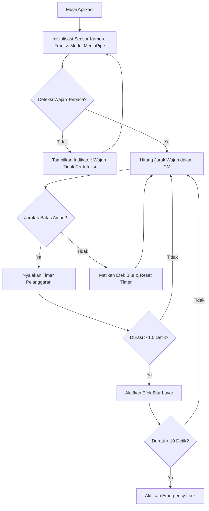

# PRODUCT REQUIREMENT DOCUMENT (PRD) - VISIONSAFE
## SISTEM PENGAWASAN JARAK MATA & PENCEGAHAN COMPUTER VISION SYNDROME (CVS)
--------------------------------------------------------------------------------
**Mata Kuliah:** Penjaminan Mutu Perangkat Lunak (SQA)
**Dokumen:** Product Requirement Document & Layout Testing Guide
**Status:** FINAL - APPROVED FOR PRODUCTION

---

## 1. PENDAHULUAN & TUJUAN UTAMA
### 1.1 Latar Belakang
Computer Vision Syndrome (CVS) merupakan gangguan kesehatan mata yang kian merebak pada era digital, ditandai dengan gejala mata lelah, kering, pandangan kabur, dan sakit kepala akibat paparan layar monitor atau smartphone secara berlebihan dalam jarak yang terlalu dekat (< 35 cm).

### 1.2 Tujuan Utama Aplikasi (VisionSafe)
1. **Pencegahan Proaktif:** Memantau jarak pandang mata ke layar smartphone secara real-time dengan kamera depan.
2. **Intervensi Instan:** Mencegah pengguna melanjutkan aktivitas screen-time berlebih jika melanggar batas jarak aman dengan menerapkan efek blur dinamis pada layar.
3. **Edukasi & Gamifikasi:** Menyediakan latihan senam mata terpadu untuk merilekskan otot siliaris mata serta memberikan reward berupa stiker koleksi (Vizo Stickers) untuk memicu kebiasaan sehat.

---

## 2. KEBUTUHAN FUNGSIONAL FITUR (FUNCTIONAL REQUIREMENTS)
Aplikasi VisionSafe dibagi ke dalam modul-modul fungsional berikut:

### 2.1 Modul AI Eye Guardian (Computer Vision Analyzer)
- **FR-1.1:** Sistem wajib menangkap frame wajah melalui kamera depan dengan sampling rate 1 detik sekali.
- **FR-1.2:** Sistem harus mampu mendeteksi 478 koordinat wajah menggunakan algoritma Google MediaPipe Face Mesh.
- **FR-1.3:** Sistem wajib menghitung Jarak Antar Pupil (IPD - Interpupillary Distance) secara 3D menggunakan prinsip Euclidean Distance:
  $$\text{Jarak Pixel} = \sqrt{(x_2-x_1)^2 + (y_2-y_1)^2 + (z_2-z_1)^2}$$
- **FR-1.4:** Sistem wajib mengonversi nilai Pixel ke centimeter (cm) melalui hukum Triangle Similarity:
  $$\text{Jarak Nyata (cm)} = \frac{\text{Lebar Mata Asli (6.3 cm)} \times \text{Focal Length (820.0)}}{\text{Jarak Pixel}}$$
- **FR-1.5:** Sistem wajib mengaplikasikan Low-Pass Filter untuk melembutkan angka jarak (smoothing) agar terbebas dari noise (jitter).

### 2.2 Modul Intervensi Layar (Blur Overlay & Emergency Lock)
- **FR-2.1:** Jika jarak terdeteksi di bawah ambang batas aman (default < 35 cm) selama lebih dari 1.5 detik, layar smartphone wajib di-blur secara bertahap (Opacity Blur Overlay aktif).
- **FR-2.2:** Jika pelanggaran jarak berlangsung terus-menerus selama lebih dari 10 detik, sistem wajib menerapkan Emergency Lock (layar blur penuh dengan peringatan keras) yang memblokir semua interaksi pengguna sampai ia menjauhkan wajah ke jarak aman.

### 2.3 Modul Senam Mata (Eye Exercise & Gamification)
- **FR-3.1:** Menyediakan permainan interaktif senam mata dengan petunjuk arah pandangan (atas, bawah, kiri, kanan, kedip).
- **FR-3.2:** Menghitung skor keberhasilan dan menyimpan hasil latihan ke database lokal (Hive) secara persisten.
- **FR-3.3:** Membuka stiker hadiah (Vizo Stickers) jika pengguna berhasil menyelesaikan latihan harian atau mengumpulkan skor kumulatif tertentu.

---

## 3. ALUR PROSES BISNIS (BUSINESS WORKFLOW)

---

## 4. PERSYARATAN SISTEM & SPESIFIKASI TEKNIS
- **Perangkat Keras (Hardware):** Smartphone Android dengan kamera depan minimal 5 MP, RAM minimal 3 GB.
- **Perangkat Lunak (Software):** Android OS SDK 21 (Android 5.0) hingga Android 13.
- **Arsitektur Aplikasi:** Clean Architecture dengan GetX State Management (Pemisahan Data Layer, Presentation Layer, Domain/Service Layer).
- **Database:** Supabase PostgreSQL (Cloud Database) untuk sinkronisasi telemetri jangka panjang dan Hive DB (Local NoSQL) untuk cache telemetri offline dan progress gamifikasi.

---

## 5. RENCANA LAYOUT TESTING & OPERATION TEST (CRITERIA 2)
Layout Testing berfokus pada verifikasi kualitas visual (Responsiveness, Overflow, Text Alignment) pada berbagai ukuran layar.

### 5.1 Rencana Pengujian Layout
| Kode Test | Item yang Diuji | Skenario Pengujian | Hasil yang Diharapkan |
| :--- | :--- | :--- | :--- |
| **LT-01** | Splash View | Menjalankan aplikasi pada resolusi layar kecil (e.g. 320x480). | Gambar maskot Vizo tampil proporsional tanpa ada pemotongan (cropping) atau overflow kuning di konsol. |
| **LT-02** | Login / Register View | Membuka keyboard virtual di layar input teks. | Tampilan forms otomatis bergeser ke atas (Scrollable/Resize), tidak terjadi error overflow layar tertutup keyboard. |
| **LT-03** | Home Dashboard | Memutar perangkat ke posisi Landscape (jika diijinkan) atau layar tablet. | Grid menu terdistribusi secara responsif menggunakan layout adaptif, ikon menu berukuran konsisten. |
| **LT-04** | Blur Overlay | Memicu jarak < 30 cm pada kamera. | Lapisan filter Blur menutupi keseluruhan sudut layar tanpa celah margin piksel (Fullscreen Overlay). |

### 5.2 Rencana Pengujian Operasi (Operation Test)
| Kode Test | Skenario Operasi | Langkah Pengujian | Status Sukses |
| :--- | :--- | :--- | :--- |
| **OT-01** | Intervensi Jarak Dekat | 1. Dekatkan wajah < 25 cm ke kamera. 2. Biarkan selama 2 detik. | Layar menjadi blur, dialog peringatan "Wajah Terlalu Dekat!" muncul di atas UI. |
| **OT-02** | Pemulihan Jarak Aman | 1. Dari kondisi ter-blur, jauhkan wajah > 40 cm. 2. Tunggu 1 detik. | Efek blur hilang seketika, layar kembali jernih, dan status kembali normal. |
| **OT-03** | Senam Mata (Eye Exercise) | 1. Masuk ke halaman Play. 2. Pilih Senam Mata. 3. Selesaikan 5 langkah instruksi. | Poin XP bertambah, stiker baru terbuka di halaman koleksi, status tersimpan secara persisten di Hive. |
